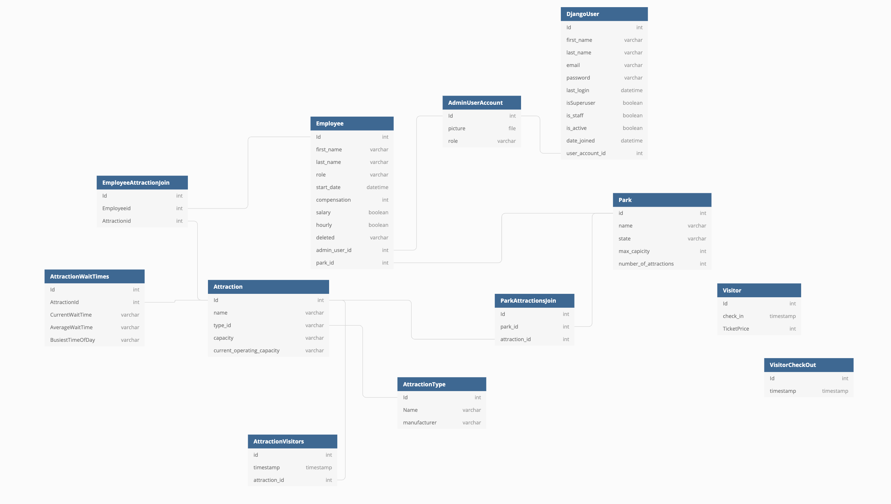
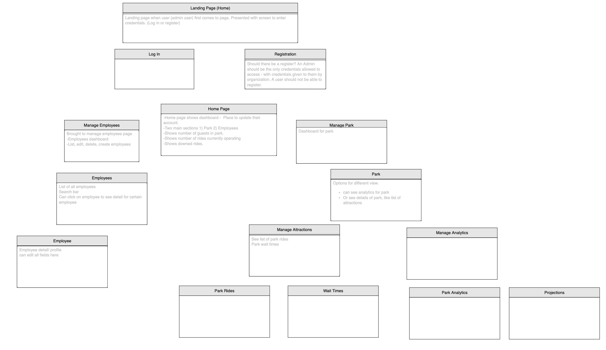

# Quantum Management
Quantum Management is a theme park management and business analysis management application built with Python/ Django. The purpose of this application is to track employees at the park, where they work, allow for addition, removal, or transition to a different role. It Only allows an admin (*HR, Management, etc...*) user to log in and have an account, and edit the employees resource to which they entered. In addition, Quantum Management provides a dashboard of analytical business intelligence information for educated business decisions, reporting, and forecasting. The information displayed is business operations and intelligence statistics like number of visitors in the park, most popular time of year, most popular rides, ride wait times, and much more customizable queries to derive financial and income tracking data. All of which are displayed using data visualization tools for easy readability and analysis.

## Entity Relationship Diagram (ERD)

## Wireframe 
* Basic stucture/ layout of the application's pages and dataflow.

