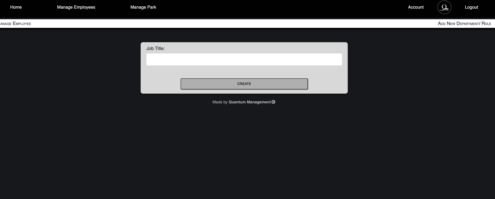
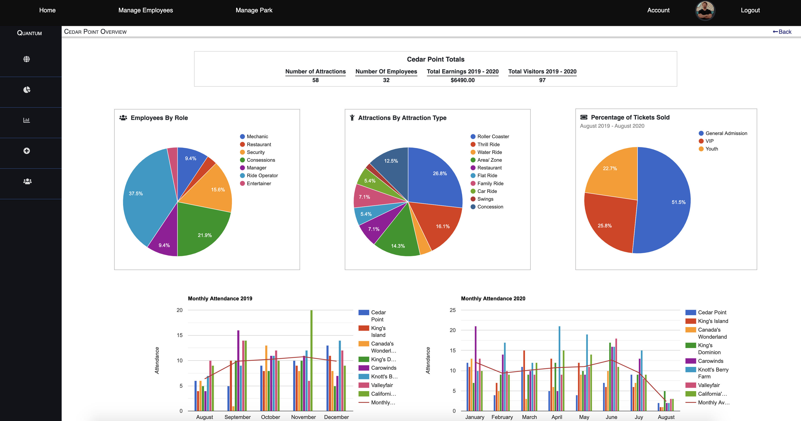

# Quantum Management
Quantum Management is a theme park management and business analysis management application built with Python/ Django. The purpose of this application is to track employees at the park, where they work, allow for addition, removal, or transition to a different role. It Only allows an admin (*HR, Management, etc...*) user to log in and have an account, and edit the employees resource to which they entered. In addition, Quantum Management provides a dashboard of analytical business intelligence information for educated business decisions, reporting, and forecasting. The information displayed is business operations and intelligence statistics like number of visitors in the park, most popular time of year, most popular rides, ride wait times, and much more customizable queries to derive financial and income tracking data. All of which are displayed using data visualization tools for easy readability and analysis.

## Project Set Up
If you wish to clone this repository to run it locally, follow these steps:

#### Run Locally Just Using Django and CLI:

* `git clone git@github.com:MattCrook/quantum-management.git`
* `cd` into the directory it creates
* `python -m venv QuantumManagementEnv`
* `pip install -r requirements.txt`
* `python manage.py makemigrations`
* `python manage.py migrate`
* `python manage.py runserver`

#### Run With Docker
*Download Docker if not done so already*
* `docker build -t application:latest .`
* `docker run -it -d -p 8000:8000 application`

## Technology Used
1. Django
2. Python
3. *SQLite*
4. Now Migrated to a **PostgreSQL** Database
5. Fixtures
6. Django ORM & SQL queries
7. Models
9. Name spacing using Django router
10. Function based views to have more control over abstraction. 
11. Class based views for API in which client side utilizes mainly for data visualizations.
12. Testing with unittest and PyTest.
13. User authentication and authorization
14. URL routing using Name Spacing
15. Docker
16. Docker Compose
17. Ngnix
18. JWT Token Based Authentication

# What Does Quantum Management Offer?
Quantum Management is a management and data analytics application that allows a logged in admin user to do the following:

## Home Page

## Login/ Register

  

## Account

Once given credentials and logged in, an admin user may set up their account profile where they will see and be able to edit their personal information including profile picture, username, first and last name, employees assigned to them and they manage, etc...

## Manage Employees

Navigating to Manage Employees, Admin User can select which department they would like to see a full list of employees for which the employees work in.

* On the left dashboard, the Admin user also has options to quickly navigate to other options, including:
  * Adding a new department
  * Adding a new employee
  * Seeing a comprehensive list/ view of all departments with all employees that work in those respective departments.

**Full List**

  

**Add (hire) a new employee.**

  * Can edit/ delete an existing employee. However, only if the current authenticated admin user originally added that employee.
  * Can see details of a specific employee. For example which attraction they are assigned to, their wage, start date ect...

**Add New Department**

## Manage Park

Admin user can see a full list of parks that are currently owned/ under the organization for which they are employed.

  * Admin user can add a new park, or edit an existing one.
  * By navigating to a specific park, admin user is brought to a dashboard with many options including:
    * Park details
      * Attractions in park, categorized by *attraction type*
      * Which employees work on that attraction
      * Details and specs for that specific attraction
      * 
    * Employees
      * Admin user can easily read list of employees that work at the current park for a filtered list of employees rather then the full list of all employees as mentioned above.
      * 
    * Add Attraction
      * Admin user can add (or remove) a new attraction (and *attraction type*) to the current park.
      * 

### Analytics Overview
Dashboard of broad business operations information broken down and formatted into easy to consume visualizations for high level representation of analytics for the park.

## Park Analytics

Data analysis information for creating data visualizations for business operations and intelligence, as well as accurate data for business forecasting and income tracking analytics. (**Currently Work In Progress**)

* This section is a collection of dashboards and organized data about the park consisting of customizable and *toggle-able* visualizations for visualizations of the abundance of data about the park, its attractions, the employees, and the park's attendance.

## Ending Notes

If Admin User is also given permissions of SysAdmin (superuser), they may access the Django Admin Dashboard.

<!-- 
## Entity Relationship Diagram (ERD)

## Wireframe 
* Basic stucture/ layout of the application's pages and dataflow.

 -->
