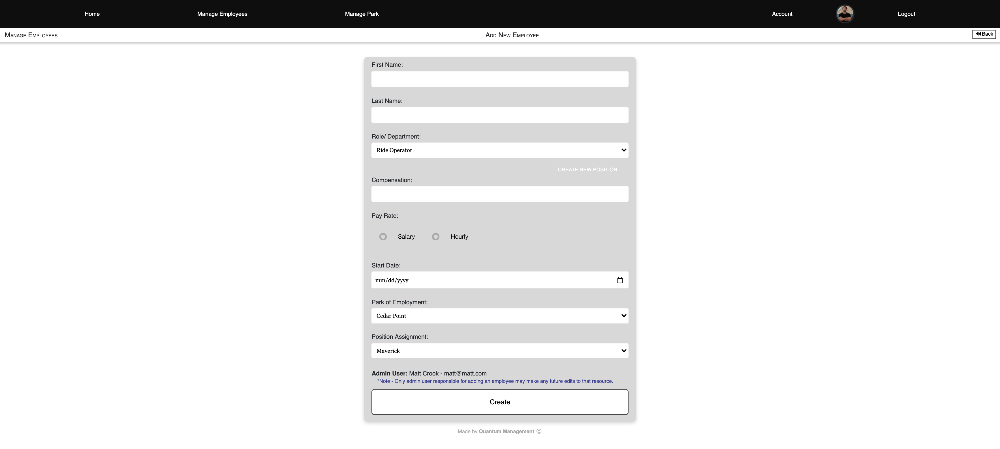

## Manage Employees

Navigating to Manage Employees, Admin User can select which department they would like to see a full list of employees for which the employees work in.

* On the left dashboard, the Admin user also has options to quickly navigate to other options, including:
  * Adding a new department
  * Adding a new employee
  * Seeing a comprehensive list/ view of all departments with all employees that work in those respective departments.

**Full List**

  

**Add (hire) a new employee.**

  * Can edit/ delete an existing employee. However, only if the current authenticated admin user originally added that employee.
  * Can see details of a specific employee. For example which attraction they are assigned to, their wage, start date ect...

**Add New Department**

