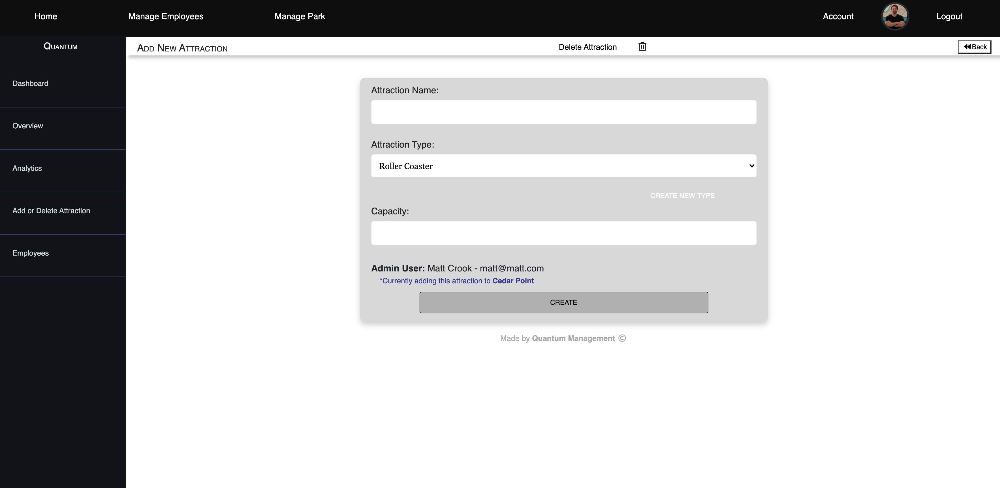

## Manage Park

Admin user can see a full list of parks that are currently owned/ under the organization for which they are employed.

  * Admin user can add a new park, or edit an existing one.
  * By navigating to a specific park, admin user is brought to a dashboard with many options including:
    * Park details
      * Attractions in park, categorized by *attraction type*
      * Which employees work on that attraction
      * Details and specs for that specific attraction
      * 
    * Employees
      * Admin user can easily read list of employees that work at the current park for a filtered list of employees rather then the full list of all employees as mentioned above.
      * 
    * Add Attraction
      * Admin user can add (or remove) a new attraction (and *attraction type*) to the current park.
      * 
